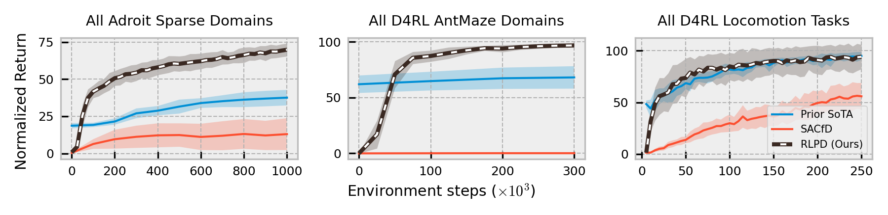

# Reinforcement Learning with Prior Data (RLPD)



This is code to accompany the paper "Efficient Online Reinforcement Learning with Offline Data", available [here](https://arxiv.org/abs/2302.02948). This code can be readily adapted to work on any offline dataset.

# Installation

```bash
conda create -n rlpd python=3.9 # If you use conda.
conda activate rlpd
conda install patchelf  # If you use conda.
pip install -r requirements.txt
conda deactivate
conda activate rlpd
```

# Experiments

## D4RL Locomotion

```bash
XLA_PYTHON_CLIENT_PREALLOCATE=false python train_finetuning.py --env_name=halfcheetah-expert-v0 \
                --utd_ratio=20 \
                --start_training 5000 \
                --max_steps 250000 \
                --config=configs/rlpd_config.py \
                --project_name=rlpd_locomotion
```

## D4RL Antmaze
```bash
XLA_PYTHON_CLIENT_PREALLOCATE=false python train_finetuning.py --env_name=antmaze-umaze-v2 \
                --utd_ratio=20 \
                --start_training 5000 \
                --max_steps 300000 \
                --config=configs/rlpd_config.py \
                --config.backup_entropy=False \
                --config.hidden_dims="(256, 256, 256)" \
                --config.num_min_qs=1 \
                --project_name=rlpd_antmaze
```

## Adroit Binary

First, download and unzip `.npy` files into `~/.datasets/awac-data/` from [here](https://drive.google.com/file/d/1SsVaQKZnY5UkuR78WrInp9XxTdKHbF0x/view).

Make sure you have `mjrl` installed:
```bash
git clone https://github.com/aravindr93/mjrl
cd mjrl
pip install -e .
```

Then, recursively clone `mj_envs` from this fork:
```bash
git clone --recursive https://github.com/philipjball/mj_envs.git
```

Then sync the submodules (add the `--init` flag if you didn't recursively clone):
```bash
$ cd mj_envs  
$ git submodule update --remote
```

Finally:
```bash
$ pip install -e .
```

Now you can run the following in this directory
```bash
XLA_PYTHON_CLIENT_PREALLOCATE=false python train_finetuning.py --env_name=pen-binary-v0 \
                --utd_ratio=20 \
                --start_training 5000 \
                --max_steps 1000000 \
                --config=configs/rlpd_config.py \
                --config.backup_entropy=False \
                --config.hidden_dims="(256, 256, 256)" \
                --project_name=rlpd_adroit
```


## V-D4RL

These are pixel-based datasets for offline RL ([paper here](https://arxiv.org/abs/2206.04779)).

Download the `64px` Main V-D4RL datsets into `~/.vd4rl` [here](https://drive.google.com/drive/folders/15HpW6nlJexJP5A4ygGk-1plqt9XdcWGI) or [here](https://huggingface.co/datasets/conglu/vd4rl).

For instance, the Medium Cheetah Run `.npz` files should be in `~/.vd4rl/main/cheetah_run/medium/64px`.

```bash
XLA_PYTHON_CLIENT_PREALLOCATE=false python train_finetuning_pixels.py --env_name=cheetah-run-v0 \
                --start_training 5000 \
                --max_steps 300000 \
                --config=configs/rlpd_pixels_config.py \
                --project_name=rlpd_vd4rl
```